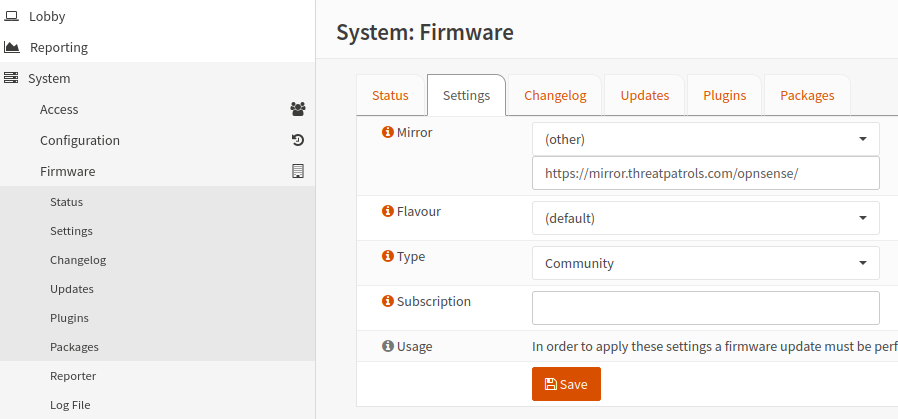

# OPNsense Mirror

The Threat Patrols mirror is a Cloudflare worker that uses object caching at Cloudflare.  This means the first 
file-object request fills our Cloudflare cache from origin, and subsequent requests are then served directly 
from a Cloudflare CDN near you.


## Setup

* Navigate to the Firmware settings on your OPNsense instance (System -> Firmware -> Settings)
* Choose **(other)** in the Mirror dropdown, and enter the Threat Patrols mirror URL

    ```text
    https://mirror.threatpatrols.com/opnsense/
    ```

&nbsp;




## Status Monitoring
We care about the uptime and reliability of our systems and make it easy to monitor and review our 
performance: 

 * [status.threatpatrols.com](https://status.threatpatrols.com)
