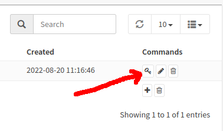
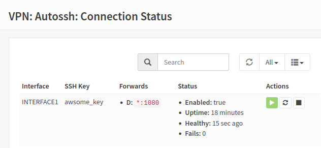

# Autossh for OPNsense

{ align=right }

The Autossh plugin for OPNsense is a wrapper around the [autossh system-package](https://www.freebsd.org/cgi/man.cgi?query=autossh)
that makes it possible to create persistent and reliable SSH based tunnels from 
remote-to-local; local-to-remote; or dynamic SOCKS5-based forward.  All tunneled 
within the safety and security of a standard SSH connection.

SSH port forwarding (and by extension Autossh) can be used to solve a wide range 
of network-service access challenges by using TCP port-forwards that are possible
without the fussiness of setting up VPN-servers and VPN-clients.  If you are able
to establish an SSH connection to a remote site then you should be able to create 
an ssh port-tunneling solution.

For example:

* Provide reverse-remote access to OPNsense-sites that have no public IP address 
  available, as is common with ISPs using super-NAT to provision customers.
* Provide redundant multipath reverse-remote access to OPNsense-sites via individual 
  external routes through the use of ssh-tunnel interface binding.
* Create trusted (SOCKS-based) gateways for OPNsense-sites requiring access to
  remote-networks, eg customer-network(s) or cloud-VPC-network(s).
* Create your own internet privacy VPN setup for OPNsense-site local network 
  users using a SOCKS proxy (ie Dynamic-Forward) to a (temporary) cloud instance.
* Provide local network access for just-about-any remote TCP-based service such 
  as HTTP-servers, RDP desktops, SMTP relays or other SSH servers.
* Provide all of the above in reverse, allowing remote networks the same ability 
  to access local TCP-services.

Many SSH-tunnel based recipes and solutions are possible, check your favorite 
search-engine results for "ssh port forwarding".

## Installation
Installation from the Threat Patrols package repository is possible using the standard
OPNsense Firmware-Plugin web-interface after the `os-threatpatrols` plugin has been added
to your system.

 - Package Repository: [repo](../../repo/index.md)

## Keys
Before creating an SSH-tunnel you need to create an SSH-key from the Autossh -> Settings -> Keys tab.


Create a key by pressing the __+__ symbol next to the rubbish-bin symbol on the bottom right-hand-side of 
the Autossh -> Settings -> Keys tab.

Provide a name for the key and choose a desired ssh key-type if something other than the default `Ed25519` is required.

The description field is a free-form text field that is not otherwise parsed.

The fingerprint value is available after generating the SSH key.

### SSH Private Key
SSH keys are created within the OPNsense system itself and stored (base64 encoded) in the 
OPNsense configuration `.xml` file.  There is no way to import user self generated SSH-key 
material.

!!! Danger "Note"
    Preventing the use of user-supplied keys is a deliberate-decision to prevent users
    mistakenly using keys that are also used for other purposes.

### SSH Public Key
The SSH Public key is available by pressing the key-shaped icon under "Commands" in 
the Autossh->Settings->Keys tab.



The SSH-public key is generated with a prefix that impose restrictions on the ability 
to of this SSH-key to invoke a terminal-shell; forward any kind of ssh-agent from 
OPNsense (should not exist anyway); or forward remote X-sessions (also not expected 
to exist)

The SSH-public key prefix that implements these restrictions looks like this:

```
command="",no-agent-forwarding,no-pty,no-user-rc,no-X11-forwarding
```

This limits SSH-connections to port-tunneling purposes only and means the 
private-key cannot be misused to gain shell access on the remote system.

Additionally, the SSH-public key is suffixed with the `autossh_key_id:` value 
that helps identify the same key in the OPNsense system.

The entire SSH-public key value should be cut-n-paste from the OPNsense 
user-interface to the remote system `.ssh/authorized_keys` file.

It is recommended that you use a dedicated service-account at the SSH-server 
for the purpose of operating your SSH-tunnels.  If this is not possible for 
some reason, then recall that SSH allows users to define more than one ssh-key 
in their `.ssh/authorized_keys` file and therefore allows you to continue 
using any existing keys(s) while adding another ssh-public key for this 
tunneling purpose.

## Tunnels

!!! tip
    Create an SSH-key before attempting to create an SSH-tunnel, else your SSH-connection 
    will not have any available keys to select and choose from.

Create a new tunnel by pressing the __+__ symbol next to the rubbish-bin symbol on 
the bottom right-hand-side of the Autossh->Settings->Tunnels tab.

Each option in the add SSH-tunnel setup-form provides in-line help that describes the 
field (press the __i__ icon).

Additionally, the in-line help also references the underlying `ssh_config` item that
can be referenced for more technical-detail when required.  Refer to the OpenSSH 
manual for the related item - https://man.openbsd.org/ssh_config

Most SSH-tunnel connections can be created with a minimum setup of:

 * `User`: username at the remote SSH-server where the SSH-public key has been added to `.ssh/authorized_keys`
 * `Hostname`: the hostname (or IP address) of the remote SSH-server
 * `SSH key name`: the name of the SSH-key previously created.
 * Any of `Local Forward`, `Remote Forward` or `Dynamic Forward` for the tunnels themselves

Also pay attention to the `Bind Interface` since this is the interface used by 
autossh to create the SSH connection.  If the primary-address on 
the `Bind Interface` does not have a route to the `Hostname` the connection 
will not be possible.

Create the tunnel by pressing the "Save" button.

!!! attention
    New tunnels do not automatically start until the user navigates to __Connection Status__ 
    and manually starts the connection.  However, once a tunnel has been started it will always 
    work to auto-reconnect while the tunnel `Enabled` setting is set as true.

See the [Examples](#examples) section for examples in setting up common situations and scenarios.

## Connection Status
The Connection Status view provides the ability to Start/Stop connections and provides
a view of the SSH-connection status.



The Status column provides:

 * Enabled: defines the SSH-tunnel status
 * Uptime: total time the current SSH-connection has been up without failure. 
 * Fails: the count of ssh-connection failures for this ssh-tunnel since system start.
 * Healthy: time since the last loopback health check was tested and successful.  New 
   connections report "pending" status until the first health-check (60 second interval).

The Healthy signal is derived from a feature of autossh that tests if a TCP connection
is possible when passed through a loopback arrangement that consists of a port-forward 
to the remote-server with a port-remote that returns the same TCP connection back to the
autossh process - hence the loopback.

The health-check occurs every 60 seconds and unhealthy connections are terminated and 
automatically recreated - this increments the "Fails" count.  

Because connection health checks occur every 60 seconds, you may observe connections
in a "pending" state until the first health-check completes.  The ssh-tunnel may already 
be up and operational before the healthy signal.

## Examples

### Local SOCKS proxy 
Scenario: provide OPNsense-site local-network users with a SOCKS proxy on the OPNsense
instance that can be used by local-network users to access network resources as if they
are from the remote-ssh host.

 * Create an Autossh ssh-tunnel to a remote ssh-server
 * Define an Autossh `Dynamic Forward` with `*:1080` for this ssh-tunnel
 * Check your firewall rules permit local network connections to TCP1080 on the firewall
 * Configure your local-network users to use the SOCKS proxy, for example in the Firefox
   web-browser navigate Settings->General->Network Settings and define a SOCKS Host
   with the local-network IP address of your OPNsense instance and TCP1080. 

!!! danger 
    Make sure you do not accidentally create an open public-proxy if using a 
    Dynamic Forward definition with `*:1080`

    Either create appropriate firewall rules that prevent unwanted access to TCP1080 or
    adjust the `Dynamic Forward` definition to the local-network address that you wish 
    to make the SOCKS proxy available from - ideally do both.

### Reverse remote access
Scenario: OPNsense-site location receives external network connectivity via an ISP that
uses Super-NATs (or carrier-grade NAT) such that the ISP customer does not have any 
access to a public IP address.

 * Establish an ssh-server in a network where you have access (eg, hosted server) 
 * Create an Autossh ssh-tunnel that connects to this remote ssh-server
 * Define an Autossh `Remote Forward` with `127.0.0.1:2222 127.0.0.1:22` for this ssh-tunnel
 * SSH to the remote ssh-server and then from there ssh to 127.0.0.1:2222 which will
   tunnel back to the OPNsense host on TCP22 - consider setting this up using a 
   client-side `ProxyJump` definition to save the manual effort of ssh'ing to the first
   ssh-server and then again to 127.0.0.1:2222

### Local SMTP relay
Scenario: local network users require access to an SMTP that is only available in
a network that exists behind an ssh-server.

 * Create an Autossh ssh-tunnel to a remote ssh-server
 * Define an Autossh `Local Forward` with `*:25` for this ssh-tunnel
 * Check your firewall rules permit local network connections to TCP25 on the firewall
 * Configure your local-network users to use the SMTP that now appears as if exists 
   from the local-network IP address of your OPNsense instance.

!!! danger 
    Make sure you do not accidentally create an open smtp-relay if using a 
    Local Forward definition with `*:25`

---

## Issues
Please post issues via Github:

 * [github.com/threatpatrols/opnsense-plugin-autossh/issues](https://github.com/threatpatrols/opnsense-plugin-autossh/issues) 

## Source
 * [github.com/threatpatrols/opnsense-plugin-autossh](https://github.com/threatpatrols/opnsense-plugin-autossh)

## Copyright
* All rights reserved.
* Copyright &copy; 2022-2025 Threat Patrols Pty Ltd &lt;contact@threatpatrols.com&gt;
* Copyright &copy; 2018 Nicholas de Jong &lt;me@nicholasdejong.com&gt;

## License
* BSD-2-Clause - see LICENSE file for full details.
