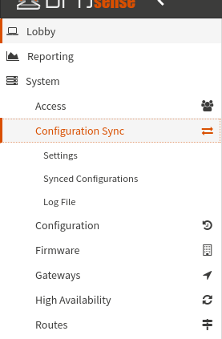
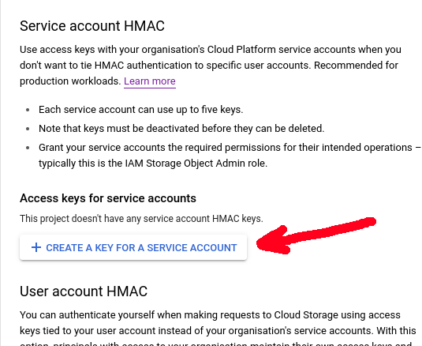
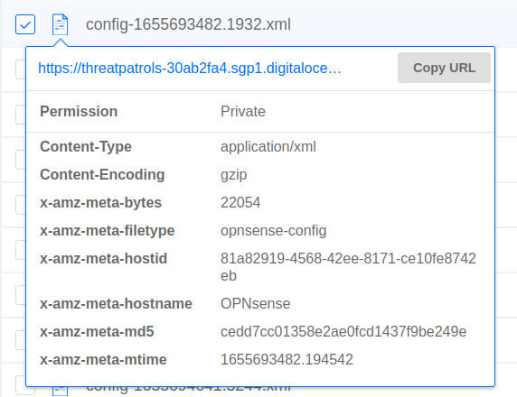

# Configuration Sync (configsync) for OPNsense

{ align=right }

Configuration Sync (configsync) is an OPNsense plugin designed to one-way 
synchronize the OPNsense system configuration `.xml` files to an (S3 compatible) 
cloud-storage provider.  Actions for `configsync` are automatically triggered 
by an OPNsense syshook-config event.

Configuration Sync is well-suited to DevOps automation situations where OPNsense
instances are re-invoked with a previously existing configuration - such as when 
using MultiCLOUDsense to handle the bootstrapping of an OPNsense cloud instance.

Configuration Sync also happens to be a great OPNsense configuration backup solution 
when used by itself.

Configuration Sync supports the following cloud storage providers:-

 * Amazon Web Services - S3
 * Google - Cloud Storage
 * Digital Ocean - Spaces
 * Other - S3 compatible endpoints

Configuration Sync uses the well known [Python Boto3](https://boto3.amazonaws.com/v1/documentation/api/latest/index.html) 
library to achieve generic S3 connectivity; if Boto3 can handle the S3 storage provider 
you should be able to use it here.

## Installation
Installation from the Threat Patrols package repository is possible using the standard
OPNsense Firmware-Plugin web-interface after the `os-threatpatrols` plugin has been added
to your system.

 - Package Repository: [repo](../../repo/index.md)

## General Settings Recommendations

 * __Storage Path__ - recommend that you use different storage paths per OPNsense 
   instance else you will end up with configuration files from multiple OPNsense 
   instances in the same S3 storage path that will clobber the `config-current.xml`
   of one another.  If this does occur, it is possible to examine the S3-object
   meta-data attributes that are added by ConfigSync to determine which files belong
   to each OPNsense instance.
 * __API Key / API Secret Credentials__ - strongly recommend that you use a dedicated 
   service-account with an access policy that constrains the service-account to permissions
   allowing `list-bucket` and `put-bucket` actions (or the storage-provider equivalent 
   of these).  The Configuration Sync tool is designed to __not__ require any `get-object` 
   or other object-read access which in-turn greatly limits risks associated with these 
   API credentials, if this restrictive service-account policy is applied.


## Storage Provider Settings
### AWS - S3
 * __Endpoint URL Override__ - generally not required for AWS-S3 since the URL endpoint
   for AWS-S3 is self-determined using their [virtual-hosted–style](https://docs.aws.amazon.com/AmazonS3/latest/userguide/access-bucket-intro.html) 
   bucket access that uses a CNAME arrangement to direct requests to the correct AWS 
   region for your bucket.
 * __Example IAM Policy__ - the AWS IAM policy below describes the minimum permissions
   policy required by a ConfigSync service account. 

    ```json
    {
        "Version": "2012-10-17",
        "Statement": [
            {
                "Effect": "Allow",
                "Action": [ "s3:ListBucket" ],
                "Resource": [ "arn:aws:s3:::BUCKET_NAME" ]
            },
            {
                "Effect": "Allow",
                "Action": [ "s3:ListBucket", "s3:PutObject" ],
                "Resource": [ "arn:aws:s3:::BUCKET_NAME/PATH_NAME/*" ]
            }
        ]
    }
    ```
    !!! note
        Be sure to replace the `BUCKET_NAME` and `PATH_NAME` values with your own values 
        if you plan to cut-n-paste from above.

### Google - Cloud Storage

  * __Endpoint URL Override__ - is not required for Google Cloud storage.
  * __API Key / API Secret Credentials__ - Google requires the creation of S3 compatible 
    [HMAC keys](https://cloud.google.com/storage/docs/authentication/hmackeys).
  * Creating HMAC credentials in brief
    * Step-1) create a service account with restrictions allowing object-list and object-write
      to your bucket, do not create any keys or other credentials for the service-account yet.
    * Step-2) navigate to your Google Storage bucket, select __Settings__ > __Interoperability__ then 
      the "Create a key for another service account" button.
    * Step 3) check the credentials using the Configuration Sync settings interface using
      the "Test Credentials" button



### Digital Ocean - Spaces

  * __Endpoint URL Override__ - is required for Digital Ocean and should be specified in the
    form `https://<region>.digitaloceanspaces.com` for example use `https://sgp1.digitaloceanspaces.com` for 
    Singapore.
  * __API Key / API Secret Credentials__ - Digital Ocean provides S3 compatible credentials
    out-of-the-box that are accessed by navigating __API__ > __Tokens/Keys__ > __Spaces access keys__

    !!! attention
        Digital Ocean does not currently provide the same type of service-accounts or access 
        policies that are possible with Google, AWS and others.  You may need to consider if 
        this type of unrestricted bucket-access is appropriate for your use case.

### Other - S3 compatible

  * Configuration Sync has been tested with and is known to work with MinIO. 
  * __Endpoint URL Override__ - for example `http://192.168.100.252:9000`  NB: the risks with
    clear text http in this example URL; MinIO can (and should) be deployed on https.
  * __API Key / API Secret Credentials__ - A service-account with a policy similar to the AWS
    example works well.
  * The ability to create service-accounts and apply restrictive policies makes MinIO
    an appealing self-hosted option.


## Storage Metadata

Each OPNsense `.xml` file object written by Configuration Sync adds extra meta-data to the 
stored file-object that helps confirm the OPNsense instance the file originated from.

These fields are

 * `filetype` - always "opnsense-config"
 * `mtime` - the last modified timestamp of the OPNsense config file
 * `bytes` - the file size in bytes of the OPNsense config file
 * `md5` - the md5-digest of the OPNsense config file
 * `hostid` - the unique host-id of the OPNsense system
 * `hostname` - the hostname of the OPNsense system



These values are helpful in filtering and selecting specific configuration files from the 
storage-provider bucket at a later time.

(Don't worry the observable attributes in the screenshot are not real)

---

## Issues
Please post issues via Github:

 * [github.com/threatpatrols/opnsense-plugin-configsync/issues](https://github.com/threatpatrols/opnsense-plugin-configsync/issues) 

## Source
 * [github.com/threatpatrols/opnsense-plugin-configsync](https://github.com/threatpatrols/opnsense-plugin-configsync)

## Copyright
* All rights reserved.
* Copyright &copy; 2022-2025 Threat Patrols Pty Ltd &lt;contact@threatpatrols.com&gt;
* Copyright &copy; 2018 Nicholas de Jong &lt;me@nicholasdejong.com&gt;

## License
* BSD-2-Clause - see LICENSE file for full details.
