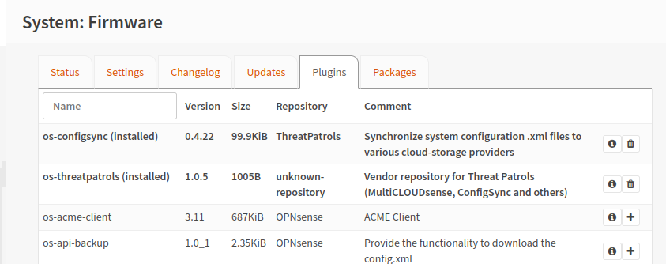

# Threat Patrols Repo for OPNsense packages
Threat Patrols operates a repository for OPNsense packages signed by Threat Patrols 
that allow you to easily install our packages and plugins.

!!! info
    The Threat Patrols package repo is delivered via Cloudflare CDN from [https://repo.threatpatrols.com](https://repo.threatpatrols.com){target=_blank}

## Install
Add the Threat Patrols package repository to your OPNsense instance by installing 
the `os-threatpatrols` plugin from the OPNsense instance terminal.

If you decide later that you'd like to remove the Threat Patrols package repo, you can 
simply remove the plugin using the regular OPNsense web-interface.

Use the following command (as root) to install the `os-threatpatrols` plugin

#### OPNsense 25.1
```shell
pkg-static add \
  "https://repo.threatpatrols.com/opnsense/FreeBSD:14:amd64/25.1/stable/Latest/os-threatpatrols.pkg"
```

??? example "Sample command output (click to expand)"

    You should see output similar to this

    ```shell
    root@OPNsense:~ #
    root@OPNsense:~ # pkg-static add "https://repo.threatpatrols.com/opnsense/FreeB
    Fetching os-threatpatrols.pkg: 100%    5 KiB   4.9kB/s    00:01
    Installing os-threatpatrols-1.0.33...
    Extracting os-threatpatrols-1.0.33: 100%
    Updating OPNsense repository catalogue...
    Fetching meta.conf: 100%    163 B   0.2kB/s    00:01
    Fetching packagesite.pkg: 100%  248 KiB 253.6kB/s    00:01
    Processing entries: 100%
    OPNsense repository update completed. 868 packages processed.
    Updating ThreatPatrols repository catalogue...
    Fetching meta.conf: 100%    104 B   0.1kB/s    00:01
    Fetching packagesite.pkg: 100%    3 KiB   3.1kB/s    00:01
    Processing entries: 100%
    ThreatPatrols repository update completed. 3 packages processed.
    All repositories are up to date.
    OK
    OK
    Configuring system logging...done.
    Stopping configd...done
    Starting configd.
    root@OPNsense:~ #
    ```

#### OPNsense 24.7 to 21.1
Earlier OPNsense versions are possible by adjusting the source URL to suit, for example OPNsense23.1
```shell
pkg-static add \
  "https://repo.threatpatrols.com/opnsense/FreeBSD:13:amd64/23.1/stable/Latest/os-threatpatrols.pkg"
```

Note that OPNsense 21.1 and 21.7 are based on FreeBSD:12 so if you still require these older (and now unsupported)
versions that you'll need to adjust the `FreeBSD:13:amd64` portion of the URL to suit as well.

#### Plugins installed example
{ align=right }


## Release Streams
It is possible to switch ThreatPatrols release streams from the terminal with 
the following commands.

#### Stable
```shell
configctl threatpatrols repo use_stable
```

??? example "Sample command output (click to expand)"

    Only if there is a change in the ThreatPatrols repo being used will an update
    occur, as shown below -

    ```shell
    root@OPNsense:~ # configctl threatpatrols repo use_stable
    Updating OPNsense repository catalogue...
    Fetching meta.conf: . done
    Fetching packagesite.pkg: .......... done
    Processing entries: .......... done
    OPNsense repository update completed. 798 packages processed.
    Updating ThreatPatrols repository catalogue...
    Fetching meta.conf: . done
    Fetching packagesite.pkg: . done
    Processing entries: . done
    ThreatPatrols repository update completed. 4 packages processed.
    All repositories are up to date.
    root@OPNsense:~ #
    ```

#### Testing
Only use the testing release stream if you are comfortable in dealing with occasional
issues and are willing to report those issues via the related Github issues channel.
```shell
configctl threatpatrols repo use_testing
```

#### Develop

!!! caution
    A release-stream for `ThreatPatrolsDevelop` exists via the `use_develop` 
    argument, however it is __not__ recommended and is subject to regular change, 
    breakage and failure.

## Remove
You can easily remove the Threat Patrols package repo from your OPNsense system
by uninstalling the `os-threatpatrols` via the regular OPNsense web-interface 
via System -> Firmware -> Plugins menu.

Alternatively, you can remove using from a (root) terminal prompt
```shell
pkg remove os-threatpatrols
```

??? example "Sample command output (click to expand)"

    You should see output similar to this

    ```shell
    root@OPNsense:~ # pkg remove os-threatpatrols
    Checking integrity... done (0 conflicting)
    Deinstallation has been requested for the following 1 packages (of 0 packages in the universe):
    
    Installed packages to be REMOVED:
            os-threatpatrols: 1.0.20
    
    Number of packages to be removed: 1
    
    Proceed with deinstalling packages? [y/N]: y
    [1/1] Deinstalling os-threatpatrols-1.0.20...
    [1/1] Deleting files for os-threatpatrols-1.0.20: 100%
    root@OPNsense:~ #
    ```

!!! note

    When you remove `os-threatpatrols` you are removing the system information that tells 
    OPNsense where the Threat Patrols repo is.  If you have Threat Patrols plugins installed 
    when you remove `os-threatpatrols` then those remaining packages and plugins will appear 
    as "orphans" since they no longer know which repo they belong to.

## Repo Status Monitoring
Additional to being transparent about our [system-uptime](https://status.threatpatrols.com/){target=_blank} 
we also closely monitor the packaging status across each of our release (Stable, Testing) for each supported 
OPNsense release. 

 * Packages Status: [status.threatpatrols.com/status/package-status](https://status.threatpatrols.com/status/package-status){target=_blank}

## Signing Key Fingerprints
Threat Patrols makes our key-fingerprints of the package signing keys available through our 
repo

 * Signing Key Fingerprints: [repo.threatpatrols.com/keys/](https://repo.threatpatrols.com/keys/){target=_blank}

When you install the Threat Patrols repo-plugin `os-threatpatrols` you are adding our signing-key 
fingerprints to your OPNsense host.  This mechanism ensures the packages you are installing 
really come from us.

Our signing key fingerprints are located on your OPNsense system in the path
```
/usr/local/etc/pkg/fingerprints/ThreatPatrols/trusted
```

We supply 2x fingerprints to future-proof any situation where we decide to revoke our current
packag signing key.

 * Current package signing key: `repo.threatpatrols.com-opnsense_20220105b`

You may additionally observe a "revoked" key in our repo `repo.threatpatrols.com-opnsense_20220105a.fingerprint` 
this key purely exists for testing to confirm the packaging tooling correctly rejects any 
package signed by this key - it is not used for any other purpose.

## Key Fingerprint Verification
We GPG sign our `.fingerprint` files allowing you to independently confirm our fingerprints 
are really from us.  We use the same [GPG key](https://www.threatpatrols.com/.well-known/threatpatrols.pgp) 
as per our [`security.txt`](https://www.threatpatrols.com/.well-known/security.txt) to sign 
these.

Steps to confirm our `.fingerprint` files:

Step 1) Acquire the Threat Patrols GPG public key - https://www.threatpatrols.com/.well-known/threatpatrols.pgp
```shell
curl --silent 'https://www.threatpatrols.com/.well-known/threatpatrols.pgp' | gpg --import
```
You may additionally observe our GPG key as being available via [public-keyservers](https://keyserver.ubuntu.com/pks/lookup?search=0x2C78E60FD912408F&fingerprint=on&op=index)

Step 2) Confirm GPG key-id `0x2C78E60FD912408F` for `security@threatpatrols.com`
```shell
gpg --list-key 2C78E60FD912408F
```

You should observe a response that details our GPG key
```
pub   rsa4096 2022-05-15 [SC] [expires: 2025-12-31]
      B512FB731A4C61FB45E27C3C2C78E60FD912408F
uid           [ unknown] Threat Patrols Security (20220515a) <security@threatpatrols.com>
sub   rsa4096 2022-05-15 [E]
```

Step 3) Confirm the fingerprint file(s)
```shell
wget 'https://repo.threatpatrols.com/keys/trusted/repo.threatpatrols.com-opnsense_20220105b.fingerprint'
wget 'https://repo.threatpatrols.com/keys/trusted/repo.threatpatrols.com-opnsense_20220105b.fingerprint.sig'
gpg --verify repo.threatpatrols.com-opnsense_20220105b.fingerprint.sig
```

You should observe a response that confirms `repo.threatpatrols.com-opnsense_20220105b.fingerprint` is
signed by `0x2C78E60FD912408F` (the last 16x chars of the key-fingerprint)
```
gpg: assuming signed data in 'repo.threatpatrols.com-opnsense_20220105b.fingerprint'
gpg: Signature made Sat 23 Jul 2022 01:25:52 AM UTC
gpg:                using RSA key B512FB731A4C61FB45E27C3C2C78E60FD912408F
gpg:                issuer "security@threatpatrols.com"
gpg: Good signature from "Threat Patrols Security (20220515a) <security@threatpatrols.com>" [unknown]
gpg: WARNING: This key is not certified with a trusted signature!
gpg:          There is no indication that the signature belongs to the owner.
Primary key fingerprint: B512 FB73 1A4C 61FB 45E2  7C3C 2C78 E60F D912 408F
```

---

## Issues
Please post issues via Github:

 * [github.com/threatpatrols/opnsense-plugin-threatpatrols/issues](https://github.com/threatpatrols/opnsense-plugin-threatpatrols/issues) 

## Source
 * [github.com/threatpatrols/opnsense-plugin-threatpatrols](https://github.com/threatpatrols/opnsense-plugin-threatpatrols)

## Copyright
* All rights reserved.
* Copyright &copy; 2022-2025 Threat Patrols Pty Ltd &lt;contact@threatpatrols.com&gt;

## License
* BSD-2-Clause - see LICENSE file for full details.
